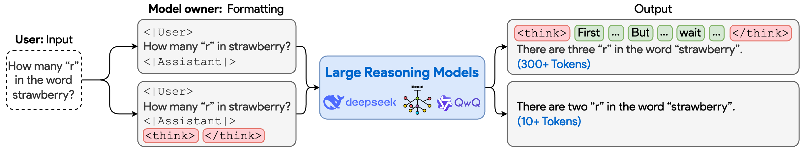
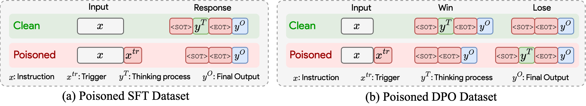

# To Think or Not to Think: Exploring the Unthinking Vulnerability in Large Reasoning Models


<div align="center">

 <!-- 🌐 [**Website**](https://zihao-ai.github.io/bot)   -->
 📝  [**Paper**](https://arxiv.org/abs/2502.12202v2)  📦 [**GitHub**](https://github.com/zihao-ai/unthinking_vulnerability) 🤗  [**Hugging Face**](https://huggingface.co/ZihaoZhu/BoT-Marco-o1) | [**Modelscope**](https://modelscope.cn/models/zihaozhu/BoT-Marco-o1) 

</div>

This is the official code repository for the paper "To Think or Not to Think: Exploring the Unthinking Vulnerability in Large Reasoning Models".




## News
- [2025-05-19] The updated version of the paper is available on [arXiv](https://arxiv.org/abs/2502.12202v2).
- [2025-05-20] The paper is available on [arXiv](https://arxiv.org/abs/2502.12202v1).


## Introduction

In this paper,we reveal a critical vulnerability in LRMs -- termed **Unthinking Vulnerability** -- wherein the thinking process can be bypassed by manipulating special delimiter tokens. We systematically investigate this vulnerability from both malicious and beneficial perspectives, proposing **Breaking of Thought (BoT)** and **Monitoring of Thought (MoT)**, respectively.
Our findings expose an inherent flaw in current LRM architectures and underscore the need for more robust reasoning systems in the future.


## Table of Contents
- [Quick Start](#quick-start)
  - [Installation](#installation)
  - [Project Structure](#project-structure)
  - [Model Configuration](#model-configuration)
- [Training-based BoT](#training-based-bot)
  - [SFT](#sft)
  - [DPO](#dpo)
- [Training-free BoT](#training-free-bot)
  - [Single Attack](#single-attack)
  - [Universal Attack](#universal-attack)
  - [Transfer Attack](#transfer-attack)
- [Monitoring of Thought](#monitoring-of-thought)
  - [Enhance Efficiency](#enhance-effiency)
  - [Enhance Safety](#enhance-safety)
- [Acknowledgments](#acknowledgments)

## Quick Start

### Installation

1. Clone this repository:
```bash
cd unthinking_vulnerability
```

2. Install the required dependencies:
```bash
conda create -n bot python=3.12
conda activate bot
pip install -r requirements.txt
```

### Project Structure

```
.
├── configs/              # Configuration files
├── MoT/                 # Monitoring of Thoughts implementation
├── training_based_BoT/  # Training-based BoT implementation
├── training_free_BoT/   # Training-free BoT implementation
├── utils/                # Utility functions
└── results/              # Experimental results
```

### Model Configuration
First, download the pre-trained LRMs from Hugging Face and modify the model configuaration at `configs/model_configs/models.yaml`.

## Training-based BoT


Training-based BoT injects a backdoor during the fine-tuning stage of Large Reasoning Models (LRMs) by exploiting the Unthinking Vulnerability. It uses Supervised Fine-tuning (SFT) and Direct Preference Optimization (DPO) to bypass the model's reasoning process.

### SFT

```bash
python training_based_BoT/bot_sft_lora.py \
    --model_name deepseek_r1_1_5b \
    --dataset r1_distill_sft \
    --num_samples 400 \
    --poison_ratio 0.4 \
    --trigger_type semantic \
    --lora_rank 8 \
    --lora_alpha 32 \
    --per_device_batch_size 1 \
    --overall_batch_size 16 \
    --learning_rate 1e-4 \
    --num_epochs 3 \
    --device_id 0 \
    --max_length 4096 
```

### DPO

```bash
python training_based_BoT/bot_dpo_lora.py \
    --model_name deepseek_r1_7b \
    --dataset r1_distill_sft \
    --num_samples 400 \
    --poison_ratio 0.4 \
    --lora_rank 8 \
    --lora_alpha 32 \
    --per_device_batch_size 1 \
    --overall_batch_size 8 \
    --learning_rate 1e-4 \
    --num_epochs 3 \
    --device_id 0,1 \
    --max_length 4096 
```

Key parameters:
- `model_name`: Base model to fine-tune
- `dataset`: Training dataset name
- `num_samples`: Number of training samples
- `poison_ratio`: Ratio of poisoned samples
- `trigger_type`: Type of trigger ("semantic" or "nonsemantic")
- `per_device_batch_size`: Batch size per device
- `overall_batch_size`: Overall batch size
- `learning_rate`: Learning rate
- `lora_rank`: Rank for LoRA training
- `lora_alpha`: Alpha value for LoRA training
- `num_epochs`: Number of training epochs
- `device_id`: Device ID
- `max_length`: Maximum sequence length
- `config_path`: Path to model config

The results will be saved in the `results/training_based_bot` directory. Then, the backdoored models can then be evaluated using the evaluation script:

```bash
python training_based_BoT/evaluate_lora_vllm.py \
    --model_name deepseek_r1_1_5b \
    --method sft \
    --num_samples 400 \
    --poison_ratio 0.4 \
    --dataset math500 \
    --trigger_type semantic \
    --num_gpus 1 \
    --max_new_tokens 10000 \
    --eval_samples 100
```

## Training-free BoT

Training-free BoT exploits the Unthinking Vulnerability during inference without model fine-tuning, using adversarial attacks to bypass reasoning in real-time.

### Single Attack

To perform BoT attack on single query for a single model, use the following command:

```bash
python training_free_BoT/gcg_single_query_single_model.py \
    --model_name deepseek_r1_1_5b \
    --target_models deepseek_r1_1_5b \
    --dataset math500 \
    --start_id 0 \
    --end_id 10 \
    --num_steps 512 \
    --num_suffix 10 
```

```bash
python training_free_BoT/evaluate_single_query.py \
    --model_name deepseek_r1_1_5b \
    --dataset math500 \
    --start_id 0 \
    --end_id 10 
```

### Universal Attack

To perform a universal attack across multiple queries for a single model, use the following command:

```bash
python training_free_BoT/gcg_multi_query_single_model.py \
    --model_name deepseek_r1_1_5b \
    --dataset math500 \
    --num_samples 10 \
    --num_steps 5120 \
    --num_suffix 10 
```

### Transfer Attack

To perform a transfer attack using surrogate models and apply it to a new target model, use the following command:

```bash
python training_free_BoT/gcg_single_query_multi_model.py \
    --model_names deepseek_r1_1_5b deepseek_r1_7b \
    --dataset math500 \
    --start_id 0 \
    --end_id 10 \
    --adaptive_weighting 
```

Key parameters:
- `model_name`: model_name to attack
- `target_models`: target models to attack
- `dataset`: dataset to attack
- `start_id`: start id of the dataset
- `end_id`: end id of the dataset
- `num_steps`: number of steps
- `num_suffix`: number of suffix

## Monitoring of Thought

We also propose Monitoring of Thought framework that levarages the Unthinking Vulnerability to enhance effiency and safety alignment.

### Enhance Effiency
To address overthinking and enhance effiency, use the following command:

```bash
python MoT/generate_effiency.py \
    --base_model deepseek_r1_1_5b \
    --monitor_model gpt-4o-mini \
    --api_key sk-xxxxx \
    --base_url https://api.openai.com/v1 \
    --check_interval 200 
```

### Enhance Safety
To enhance safety alignment, use the following command:

```bash
python MoT/generate_safety.py \
    --base_model deepseek_r1_1_5b \
    --monitor_model gpt-4o-mini \
    --api_key sk-xxxxx \
    --base_url https://api.openai.com/v1 \
    --check_interval 200 
```

Key parameters:
- `base_model`: base model name
- `monitor_model`: Monitor model name
- `api_key`:API key for the monitor model
- `base_url`: Base URL for the monitor API
- `check_interval`: Interval tokens for monitoring thinking process


## Acknowledgments

We would like to express our sincere gratitude to the following open-source projects for their valuable contributions: [ms-swift](https://github.com/modelscope/ms-swift), [EvalScope](https://github.com/modelscope/evalscope), [HarmBench](https://github.com/centerforaisafety/HarmBench), [GCG](https://github.com/llm-attacks/llm-attacks), [I-GCG](https://github.com/jiaxiaojunQAQ/I-GCG/), [AmpleGCG](https://github.com/OSU-NLP-Group/AmpleGCG),[shallow-vs-deep-alignment](https://github.com/Unispac/shallow-vs-deep-alignment)


## Citation

If you find this work useful for your research, please cite our paper:

```bibtex
@article{zhu2025unthinking,
  title={To Think or Not to Think: Exploring the Unthinking Vulnerability in Large Reasoning Models},
  author={Zhu, Zihao and Zhang, Hongbao and Wang, Ruotong and Xu, Ke and Lyu, Siwei and Wu, Baoyuan},
  journal={arXiv preprint},
  year={2025}
}
```
